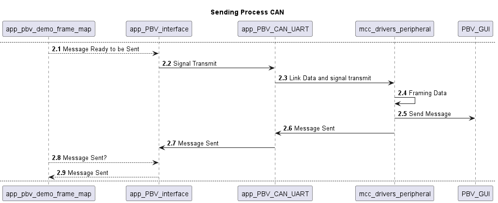
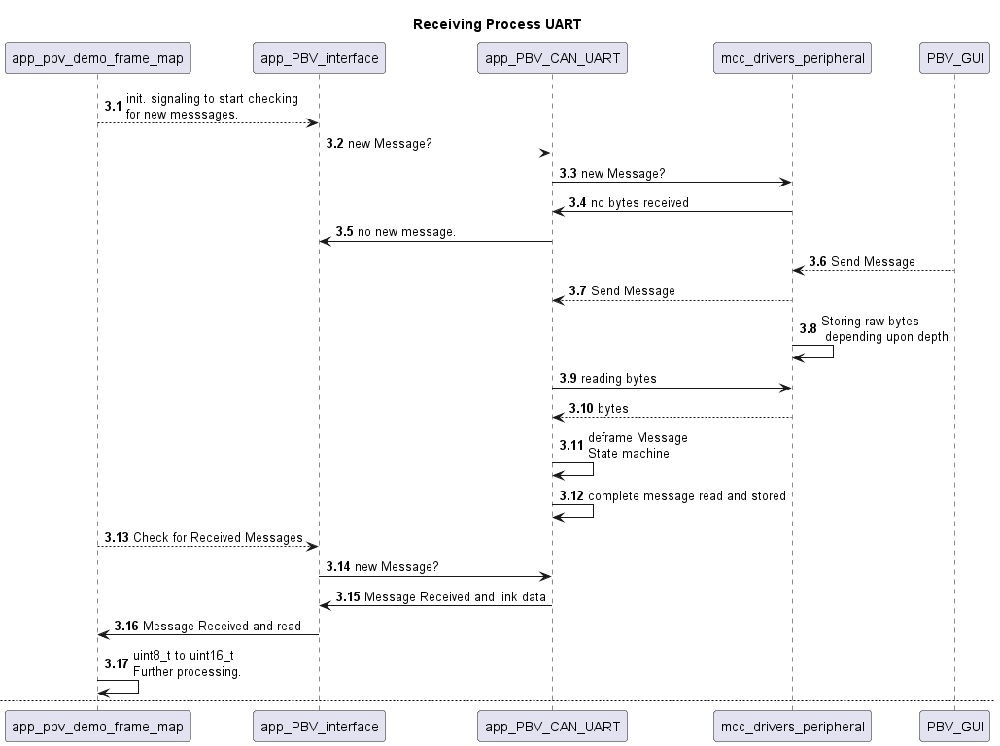
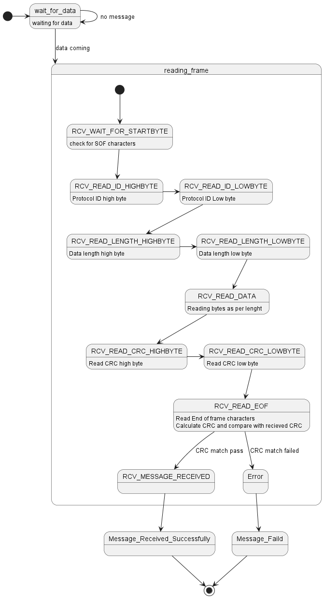

<picture>
    <source media="(prefers-color-scheme: dark)" srcset="images/microchip_logo_white_red.png">
	<source media="(prefers-color-scheme: light)" srcset="images/microchip_logo_black_red.png">
    
</picture> 

# dsPIC33C Power Board Visualizer V2 Demo

## Summary
This is a code example demonstrating the new features of the Power Board Visualizer V2 software. This is designed using dspic33ck256mp506 Digital Power Plugin Module, however with minor to no modifications this should be able to support other DP-PIMs.
## Related Documentation
Please refer to the users guide of PBV V2 that can be found on the same webage where you found this demo 

## Software Used 
to compile the code

MPLAB X <6.10> or later   
XC16 <2.10> or later 

This builds up on the drivers generated by Microchip Code Generator (MCC) Melody. 

## Hardware Used

DSPIC33CK256MP506 Digital Power PIM (MA330048)  
Digital Power Development Board (DM330029)
To have the CAN-FD functionality additional hardware is needed
Peak Systems CAN FD USB dongle  
and a Can Transceiver  for example mikroelektronika ATA6563 click.

## Setup

insert picture of setup.

## Operation
This code example is designed to work with UART and CAN.

The framing/deframing of data happens in different abstraction layers. as can be seen in the pictures below. (app_pbv_can_uart) however on the api level they are the same.

### Application State machine
#### Application State machine RX
  
#### Application State machine TX

### CAN RX and TX
#### CAN Sequence RX

#### CAN Sequence TX

### UART RX and TX
#### UART Sequence RX

#### UART Sequence TX

#### framing and deframing statemachine for UART
#### Framing statemachine UART RX

#### Framing statemachine UART TX
