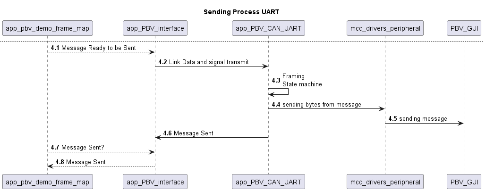

<picture>
    <source media="(prefers-color-scheme: dark)" srcset="images/microchip_logo_white_red.png">
	<source media="(prefers-color-scheme: light)" srcset="images/microchip_logo_black_red.png">
    
</picture> 

# dsPIC33C Power Board Visualizer V2 Demo

## Summary
This is a code example demonstrating the new features of the Power Board Visualizer V2 software. This demo is designed using [dsPIC33CK256MP506 Digital Power PIM](https://www.microchip.com/MA330048).This readme also aims to provide initial guide on how to setup the controller peripherals using Microchip Code Configurator (MCC) as well as a brief description on provided example drivers.

## Related Documentation
This document is intended as a supplement to the user's guide. We recommend that the user's guide is studied before reading this document. The user's guide can be found [here](https://www.microchip.com/en-us/software-library/power_board_visualizer). Also it is always nice to read the device data sheet [dsPIC33CK256MP508 Family Data Sheet](https://www.microchip.com/70005349)

## Software Used 
- [Power Board Visualizer GUI](https://www.microchip.com/SWLibraryWeb/product.aspx?product=POWER_BOARD_VISUALIZER)
- [MPLAB&reg; X IDE v6.15](https://www.microchip.com/en-us/tools-resources/develop/mplab-x-ide)
- [MPLAB&reg; X IPE v6.15](https://www.microchip.com/en-us/tools-resources/production/mplab-integrated-programming-environment)
- [MPLAB&reg; XC16 Compiler v2.10](https://www.microchip.com/en-us/tools-resources/develop/mplab-xc-compilers)
- [Microchip Code Configurator v5.4.1 or greater](https://www.microchip.com/mplab/mplab-code-configurator)

## Hardware Used

- dsPIC33CK256MP506 Digital Power PIM, Part-No. [MA330048](https://www.microchip.com/MA330048)
- Digital Power Development Board, Part-No. [DM330029](https://www.microchip.com/DM330029)
- Peak Systems CAN-FD USB dongle, Part-No. [IPEH-004022](https://www.peak-system.com/PCAN-USB-FD.365.0.html)  
- Mikroelektronika Click board High Speed CAN Transceiver, Part-No. [MIKROE-2334](https://www.mikroe.com/ata6563-click)
- DB9 cable to connect the Peak Dongle to the Click board. 

## Quick Start Guide
This section will guide the user on how to do hardware setup, program the device and run the demo.

### Hardware Setup UART
For UART the hardware required is minimal. Along with the DP-PIM and Digital Power Development board, A micro usb cable is needed to power the Digital Power Development Board as well transfer data from DP-PIM. The DP-PIM has  MCP2221A USB to UART/I2C serial converter. This means that no additional hardware is needed for UART commuincation. 

Steps: 
- Insert the DP-PIM to the J1 header on the Digital Power Development Board. 
- Connect the microusb cable to the J3 connector on the DP-PIM 
### Hardware Setup CAN-FD

For CAN-FD additonal hardware is needed in the form of a CAN transciever and a PEAK CAN FD dongle.  

Steps:
- Insert the DP-PIM to the J1 header on the Digital Power Development Board. 
- Connect the microusb cable to the J3 connector on the DP-PIM or J2 connector on Digital Power Development Board.
- Insert can transciever click board on J10 connector on the Digital Power Development Board.
- Connect the CAN FD dongle using a DB9 cable to the click board.

  

### Programming
1.	Open MPLAB X IPE
2.	Select the device on the DP-PIM: dsPIC33CK256MP506.
3.	Memory Model: Single Partition
4.	Select the debugger/programmer.
5.	Connect the debugger/programmer to the J9 connector on the Digital Power Development Board
6.	Click on the connect button.
7.	You will see in the Output window your target device in the form of these two messages.
o	Target voltage detected.
o	Target device dsPIC33CK256MP506 found.
8.	Go to the downloaded Folder for the demo, and select the hex file “PBV_V2_demo.X.production.hex”
9.	Program the device. 
10.	Wait for Program/Verify Complete message. 
11.	Disconnect programmer from the connector.

### Opening the GUI
If the Power Board Visualizer is not installed, Install the Power Board Visualizer. The setup wizard will guide through the process of installation.
Navigate to the downloaded project, and open the file gui\Power Board Visualizer Demo.xml
 
### Connect and receive data
Click on COM? button on the bottom, and the connected devices will be listed. Select the one that is connected with your system, and the data should appear.
 

## Project
This section aims to describe the provided code example along with guiding the user on how to setup the peripherals using MCC
### Directory Structure
Here is the important files in the project along with some description of the files
```
PBV_V2_demo.X
 │   main.c                         --> System Initialize and invokes the scheduler
 │   main_tasks.c                   --> All the tasks in the system
 │
 ├───mcc_generated_files            --> These drivers are generated from MCC. Each folder represents a peripheral
 │   ├───can
 │   ├───crc
 │   ├───system                     --> All system settings including oscillator
 │   ├───timer
 │   └───uart
 └───sources                        --> All the files on top of MCC
     │   project_settings.h
     │
     ├───app
     │       app_PBV_CAN.c
     │       app_PBV_CAN.h
     │       app_PBV_config.c
     │       app_PBV_config.h
     │       App_PBV_Demo_Frame_Map.c
     │       App_PBV_Demo_Frame_Map.h
     │       app_PBV_interface.c
     │       app_PBV_interface.h
     │       app_PBV_UART.c
     │       app_PBV_UART.h
     │
     ├───config
     │       config.h
     │
     ├───device
     │       dev_led.c
     │       dev_led.h
     │
     └───os
             os.c
             os.h
             os_reset.c
             os_reset.h
             os_scheduler.h
             os_scheduler_100us.c
             os_scheduler_1ms.c
             os_sys_time.c
             os_sys_time.h
             os_timer.c
             os_timer.h
             os_watchdog.c
             os_watchdog.h
             readme.md
```
### MCC Setup

Open the project in MPLAB X IDE. Click on MCC button on the top Right Corner. And then you will be greeted by the following screen.

Click on each block and you will see a graphical intergface on how to setup the peripheral. Pin view in the bottom shows the pin mapping. Many peripherals on the dsPIC are connected to Peripheral Pin Select(PPS) Module. PPS allows the user to connect peripheral to any device pin.
Click on each Device name and the associated PLIB to see the available configurable options.

### OS
The code example is built upon a operating system. This operating system takes in a system tick of 100us, and defines each process as Tasks. All of the tasks are called in main_tasks.c

### Switching from UART to CAN-FD
This code example is designed to work with UART and CAN-FD. and the option to select the underlying phsical layer is selected at compile time.  By default the code example works with UART. Go to config/config.h and change the PBV_CANFD to 1 and PBV_UART to 0, and build and compile the code. 
```
// PBV working with CAN OR UART
#define PBV_UART        1 
#define PBV_CANFD       0
```
The same Api works regardless of the underlying phsyical layer. The App_PBV_Demo_Frame_Map provides an example on how the driver can be used to map and unframe the data.

### Code Explaination

All the files in app folder repesent different abstraction layers and files 

```
    ├───app
    │       app_PBV_CAN.c
    │       app_PBV_CAN.h
    │       app_PBV_config.c
    │       app_PBV_config.h
    │       App_PBV_Demo_Frame_Map.c
    │       App_PBV_Demo_Frame_Map.h
    │       app_PBV_interface.c
    │       app_PBV_interface.h
    │       app_PBV_UART.c
    │       app_PBV_UART.h

```
#### App_PBV_Demo_Frame_Map. 
This is the main application file. Here there are tasks that run at different frequencies checking for any received messages and triggering sending of messages.

#### app_PBV_config. 
This provides a mechanism to abstract away the underlying physical layer by using function pointers, that point to different physical layers depending upon which layer is selected.

#### app_PBV_interface. 
These implement the PBV state machine of RX and TX, as well as link data that is received by peripherals to application.

#### app_PBV_UART. 
This is where the framing/deframing and transmission happens for UART frames. The fundamental difference between this and CAN-FD frames is that CAN-FD defines a strategy for framing and deframing data, and PBV follows that strategy. UART is a point to point byte by byte transfer of data. To build a frame on top of it, another layer is needed where the data is framed/deframed and trasnmitted. It defines an additional statemachine

#### app_PBV_CAN. 
This is a parallel file to app_PBV_UART. This abstracts away the MCC driver api. 


### Application State machine
#### Application State machine RX
  
#### Application State machine TX


### CAN-FD RX and TX
#### CAN Sequence RX

#### CAN Sequence TX


### UART RX and TX
#### UART Sequence RX

#### UART Sequence TX


#### Framing and Deframing State-Machine for UART
#### Framing statemachine UART RX

#### Framing statemachine UART TX
